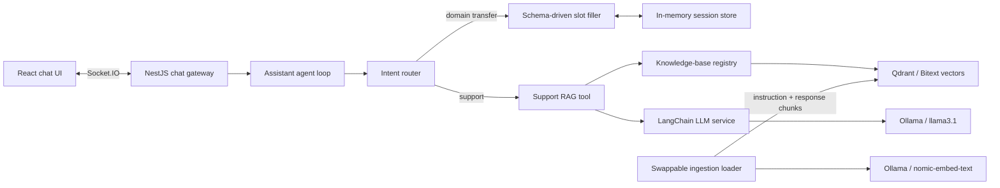

# Northstar: local pre-sales + support assistant

A demo-sized, full-stack AI assistant for a small-business web-services company. One chat and one in-memory session support two distinct jobs:

- **Pre-sales intake:** a deterministic, conversational domain-transfer checklist that explains unfamiliar terms, validates each answer, and produces an engineering-ready JSON brief.
- **Support RAG:** semantic retrieval over a subset of the public Bitext customer-support dataset, followed by a grounded answer from a local Ollama model. Weak matches fall back to a human handoff instead of guessing.

Everything runs locally with open-source components. No paid API or hosted model key is required.

## What this demonstrates

- Intent routing across two tools while preserving one WebSocket session
- Schema-driven slot filling with field-level prompts, explanations, lookup help, and validation
- A replaceable LLM boundary implemented with LangChain.js and Ollama
- A knowledge-base registry and swappable dataset-loader seam
- Qdrant cosine retrieval with source matches and a configurable confidence threshold
- A React chat experience with intake progress, retrieval evidence, and a **Copy JSON** action

## Architecture



The orchestration is intentionally small and legible. High-confidence state transitions (which field is pending and whether input is valid) are deterministic. LangChain owns model pipelines for ambiguous intent fallback and grounded response generation.

## Repository layout

```text
.
├── backend/                 NestJS WebSocket API, agent, intake, RAG, tests
├── frontend/                React + Vite single-page chat UI
├── ingestion/               Bitext loader, chunking, embeddings, Qdrant seed
├── docker-compose.yml       Ollama, Qdrant, seed, backend, frontend
└── .github/workflows/ci.yml lint, tests, and builds
```

## Quick start with Docker

Requirements: Docker Desktop with roughly 8 GB of free memory and 6 GB of disk space for images/models.

```bash
docker compose up --build
```

Then open [http://localhost:3000](http://localhost:3000).

On the first run Compose will:

1. start Qdrant and Ollama;
2. pull `llama3.1:8b` and `nomic-embed-text` (the first download can take several minutes);
3. download 2,000 Bitext instruction/response rows;
4. chunk, embed, and seed them into the `bitext_support` Qdrant collection;
5. start the NestJS backend and React frontend.

To index a smaller or larger subset:

```bash
DATASET_LIMIT=500 docker compose up --build
```

Useful URLs:

- UI: `http://localhost:3000`
- Backend health: `http://localhost:4000/health`
- Qdrant dashboard: `http://localhost:6333/dashboard`
- Ollama: `http://localhost:11434`

Stop services with `docker compose down`. Add `-v` only when you intentionally want to remove the persisted models and vectors.

## Local development

Node.js 20.19+ (22 recommended), Docker, and a local Ollama installation are required.

```bash
npm install
cp backend/.env.example backend/.env
cp frontend/.env.local.example frontend/.env.local
docker compose up -d qdrant ollama
ollama pull llama3.1:8b
ollama pull nomic-embed-text
npm run ingest
npm run dev
```

The Vite dev UI runs at `http://localhost:5173`; NestJS runs at `http://localhost:4000`.

Validation commands:

```bash
npm run lint
npm test
npm run build
# or all three
npm run check
```

## Demo conversations

Try either route from the same session:

```text
I want to transfer example.com
```

The assistant collects the registrar, EPP/authorization code, unlock state, admin-email access, 60-day eligibility, and WHOIS-privacy state. Ask “what does that mean?” at any step to see contextual help. The finished JSON is intended as a provisioning handoff; the EPP code should be handled as a temporary secret.

```text
How do I reset my password?
```

The assistant embeds the question, retrieves the top four Bitext entries, enforces `RAG_SCORE_THRESHOLD`, and sends only strong matches to the local chat model. Matching entries remain visible below the answer.

## WebSocket contract

Client event:

```json
{
  "event": "chat:message",
  "data": { "sessionId": "uuid", "message": "How do I reset my password?" }
}
```

Server events are `chat:status`, `chat:response`, and `chat:error`. A response includes `mode`, the assistant `message`, optional `matches`, intake progress, and an optional `structuredSummary`.

## Knowledge-base ingestion

`ingestion/src/datasets/types.ts` defines the small `DatasetLoader` contract. `BitextDatasetLoader` is the only dataset-specific implementation; replace it to load a private help center or another dataset without changing chunking, embeddings, Qdrant, or the backend retrieval service.

The ingestion job:

1. downloads the CSV (or reads `DATASET_PATH`);
2. keeps the configured subset;
3. combines each `instruction` and `response` into a support document;
4. chunks with overlap via LangChain text splitters;
5. embeds with `nomic-embed-text` through Ollama;
6. recreates and seeds the configured Qdrant collection.

Recreating the collection makes the seed deterministic. Do not point this demo ingestion job at a production collection without changing that behavior.

## Dataset attribution and license

This project downloads [Bitext Customer Support LLM Chatbot Training Dataset](https://huggingface.co/datasets/bitext/Bitext-customer-support-llm-chatbot-training-dataset), published by Bitext Innovations. Its dataset card describes 26,872 curated instruction/response pairs across 27 intents and 10 customer-service categories, with about 3.57 million tokens. The Hugging Face repository identifies the license as [CDLA-Sharing-1.0](https://cdla.dev/sharing-1-0/). Review that license before redistributing a derived dataset or production index.

The app stores source, category, intent, instruction, and response in each Qdrant payload so retrieved evidence can be shown to the user.

## Design decisions

- **Deterministic intake state:** an LLM does not decide whether a required field has been collected. This keeps state auditable and prevents a fluent response from skipping provisioning requirements.
- **LLM abstraction:** only `LlmService` imports the chat model. Replacing Ollama with another LangChain chat model does not change routing or tools.
- **Registry pattern:** `KnowledgeBaseRegistry` resolves the active search provider. A product KB, billing tool, or hosting-platform API can be registered alongside Bitext.
- **Guarded RAG:** low retrieval scores produce a human-handoff offer. The answer prompt explicitly forbids invented policies, URLs, or contact details.
- **Session isolation:** each browser keeps a UUID in local storage; the server stores corresponding state in memory for one hour. The demo intentionally has no login or durable customer data.

## Mapping to production

| Demo component | Production replacement or extension |
| --- | --- |
| In-memory `Map` sessions | Redis with TTLs, encryption, and authenticated tenant keys |
| Public Bitext sample | Versioned company help center, product docs, tickets, and permissions-aware retrieval |
| Qdrant single collection | Tenant/ACL payload filters, replicas, snapshots, and evaluation-backed thresholds |
| Local Ollama models | A governed internal model endpoint or autoscaled inference cluster behind `LlmService` |
| Domain-transfer JSON | An external platform API call or queued provisioning job after explicit user confirmation |
| Regex/field validators | Registrar APIs, WHOIS/RDAP checks, policy rules, and secure secret collection |
| Generic human handoff | CRM/help-desk ticket creation with transcript, consent, priority, and routing metadata |

Before production use, never place an EPP code in ordinary logs or analytics. Collect it through a secret-capable form or external vault, encrypt it in transit and at rest, restrict access, and delete it when the transfer completes. Domain-transfer rules vary by registry and registrar; the included schema uses generic public guidance and is not a substitute for live policy checks.
